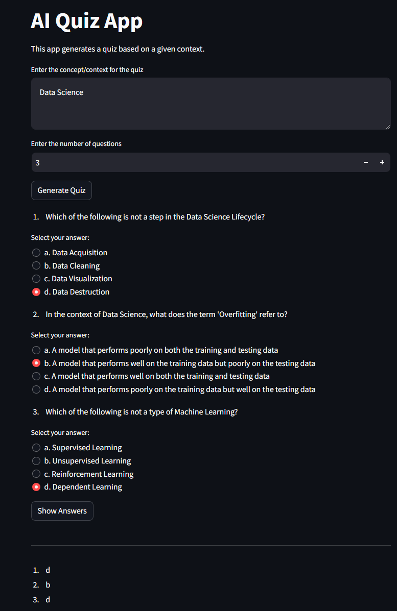

# AI Quiz App

## About
The AI Quiz App is a Streamlit web application that dynamically generates quizzes based on concepts in Artificial Intelligence, Machine Learning, Data Science, Large Language Models, Natural Language Processing, and Computer Vision. Users can input a topic and receive a customized quiz to test their knowledge, with the added capability to evaluate their answers upon completion.

## Features
- Generate quizzes with a specified number of questions based on a user-defined context.
- Multiple choice questions are dynamically created using OpenAI's GPT-4 model.
- Users can select their answers using radio buttons.
- Ability to display the correct answers and calculate the user's score.

## Configuration
Modify the `create_the_quiz_prompt_template` function to change the template used for generating quizzes.

## Contributing
Contributions to the AI Quiz App are welcome! Please follow the standard fork and pull request workflow.

## License
This project is licensed under the terms of the MIT license.

## Acknowledgements
This app was created using OpenAI's GPT-4 and Streamlit, and is designed for educational purposes.
